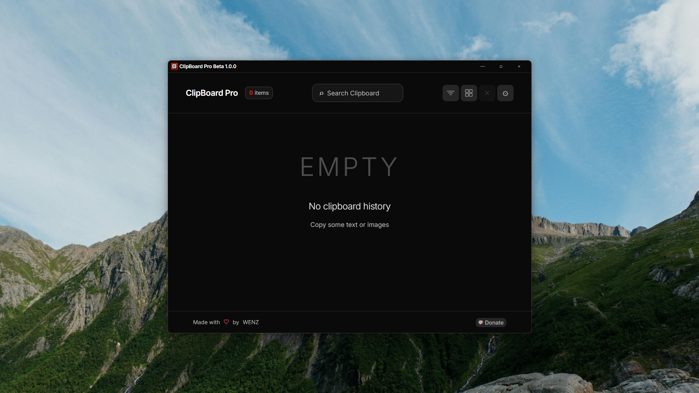
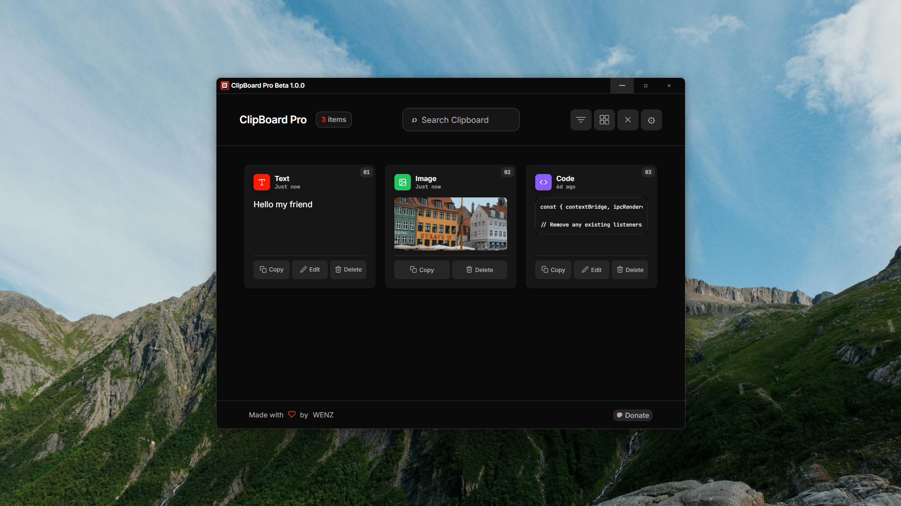
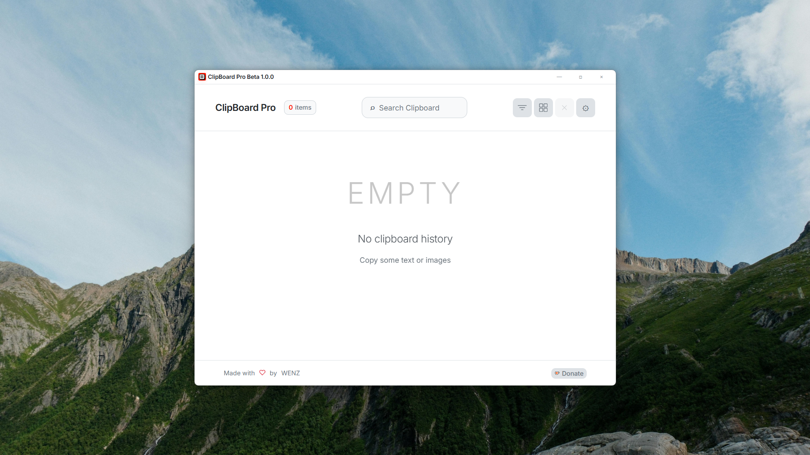
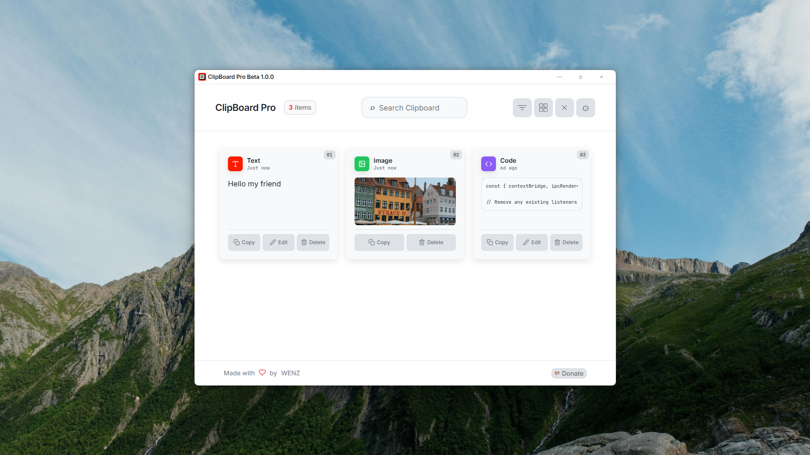
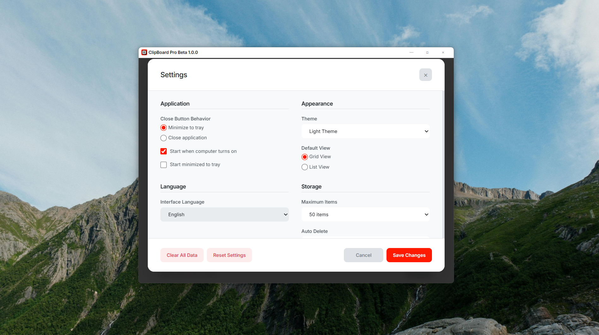

# ClipBoard Pro

A lightweight, cross-platform clipboard manager built with Electron and React. It sits in your system tray, watches your clipboard, and keeps a searchable history of everything you copy — text, code snippets, and images.

Beta 1.0.0

**Download:** https://wenzgame.itch.io/clipboard-pro

---

## Preview







---

## Why This Exists

Every developer copies and pastes dozens of things a day. Most of it vanishes the moment you copy something new. ClipBoard Pro fixes that. It runs quietly in the background, stores your clipboard history locally, and lets you recall or re-copy any previous entry with a single click.

No cloud. No accounts. No telemetry. Your data stays on your machine.

---

## Features

- **Clipboard monitoring** — Automatically captures text, code, and image entries as you copy them.
- **Search and filter** — Full-text search across your clipboard history. Filter by content type (text, code, image).
- **Grid and list views** — Switch between a compact list or a visual grid layout depending on your workflow.
- **Inline editing** — Edit any text or code entry directly from the app before re-copying it.
- **Theme builder** — Create, import, and export custom themes with a full visual editor. Ships with dark and light themes out of the box.
- **Keyboard shortcuts** — Configurable global hotkeys for quick access and clearing history.
- **Internationalization** — Multi-language support with extensible translation files.
- **System tray integration** — Minimizes to tray. Optional start-on-boot and start-minimized modes.
- **Auto-delete policies** — Configure automatic cleanup intervals from 5 minutes to 30 days, or disable it entirely.
- **Privacy controls** — Pause clipboard monitoring at any time. Option to clear history on close.

---

## Tech Stack

| Layer        | Technology                          |
|--------------|-------------------------------------|
| Runtime      | Electron                            |
| UI           | React                               |
| Styling      | SCSS with CSS custom properties      |
| Icons        | react-icons (Feather icon set)       |
| i18n         | Custom lightweight i18n utility      |
| Theming      | Runtime CSS variable injection       |
| Build        | Electron Builder (assumed)           |

---

## Getting Started

### Prerequisites

- Node.js 18 or later
- npm or yarn

### Installation

```bash
git clone https://github.com/your-username/clipboard-pro.git
cd clipboard-pro
npm install
```

### Development

```bash
npm run dev
```

This launches the Electron app in development mode with hot reload enabled for the renderer process.

### Production Build

```bash
npm run build
```

Output binaries will be placed in the `dist/` directory. Platform-specific packaging is handled by Electron Builder — see `electron-builder.yml` (or the relevant config in `package.json`) for target configuration.

---

## Project Structure

```
src/
  components/
    TitleBar.jsx          # Custom window title bar with minimize/maximize/close controls
    Header.jsx            # Search bar, filters, view toggle, settings access
    ClipboardHistory.jsx  # Main content area — renders the item list or empty state
    ClipboardItem.jsx     # Individual clipboard entry with copy/edit/delete actions
    EditModal.jsx         # Modal dialog for editing text and code entries
    SettingsModal.jsx     # Application settings — appearance, language, storage, privacy, shortcuts
    ThemeBuilder.jsx      # Visual theme editor with live preview, import/export
    Footer.jsx            # Attribution and donation link
  utils/
    i18n.js               # Translation loader and React hook
    themeManager.js        # Theme persistence, CSS variable generation, theme switching
  scss/
    *.scss                # Component-level stylesheets
```

---

## Theming

ClipBoard Pro uses CSS custom properties for all visual styling. The built-in dark and light themes cover most use cases, but the Theme Builder lets you customize everything:

- Background layers (primary, secondary, tertiary, elevated)
- Text color hierarchy
- Accent colors
- Card appearance (background, border, radius, shadow)
- Type indicator colors (text, code, image)
- Action button colors and hover states

Custom themes are stored as JSON and can be exported to share with others or imported from files. The theme format is stable and forward-compatible.

### Creating a Theme

1. Open Settings and click "Theme Builder".
2. Adjust colors and layout properties in the left panel.
3. Watch the live preview update in the right panel.
4. Enter a theme name and author.
5. Click "Save Theme".

### Sharing Themes

Use the "Export Theme" button to download a `.json` file. Others can import it through the Theme Builder's "Import Theme" button.

---

## Internationalization

Language files follow a flat key-value structure and are loaded at runtime. To add a new language:

1. Create a new translation file in the i18n directory following the existing format.
2. Register the language code and metadata in the supported languages list.
3. All UI strings are accessed through the `useLanguage()` hook via the `t()` function.

The active language persists across sessions.

---

## Clipboard Handling

When you copy an entry from within ClipBoard Pro back to your system clipboard, the app temporarily pauses its own clipboard monitor for 3 seconds to avoid re-capturing the same content as a new entry. This is handled automatically — no user intervention required.

Image entries are stored as base64 data URIs. For large images, be aware that this increases memory and storage usage proportionally.

---

## Configuration

All settings are accessible through the in-app Settings modal. Key options include:

| Setting                | Description                                              | Default         |
|------------------------|----------------------------------------------------------|-----------------|
| Close behavior         | Minimize to tray or quit the application                 | Minimize        |
| Start on boot          | Launch automatically when the system starts              | Off             |
| Start minimized        | Open directly to the system tray                         | Off             |
| Default view           | Grid or list layout                                      | Grid            |
| Maximum items          | Clipboard history size limit                             | 50              |
| Auto-delete            | Automatically remove entries after a time interval       | Never           |
| Monitor clipboard      | Enable or disable clipboard watching                     | On              |
| Quick access hotkey    | Global shortcut to bring the app to focus                | Configurable    |
| Clear all hotkey       | Global shortcut to wipe clipboard history                | Configurable    |

Settings persist between sessions via Electron's local storage APIs.

---

## Contributing

Contributions are welcome. If you are fixing a bug, please open an issue first so the problem can be discussed before you invest time in a pull request.

For new features, open an issue describing the use case and proposed approach. This helps avoid duplicate work and ensures the feature aligns with the project's scope.

### Guidelines

- Keep pull requests focused. One feature or fix per PR.
- Follow the existing code style. The codebase uses functional React components with hooks throughout.
- Test your changes on at least one platform (Windows, macOS, or Linux) before submitting.
- Update translation files if your change introduces new UI strings.

---

## License

ClipBoard Pro is free for personal and non-commercial use only.

You may not use, distribute, or incorporate this software or any portion of it in any commercial product, paid service, or revenue-generating activity without explicit written permission from the author.

You are free to fork, modify, and share this project for personal use, educational purposes, and open source contributions, provided the same non-commercial restriction is preserved.

See the [LICENSE](LICENSE) file for the full terms.

---

## Support

If you find this project useful, consider supporting development through [Ko-fi](https://ko-fi.com/wenzdev).

For bugs and feature requests, use the [issue tracker](https://github.com/your-username/clipboard-pro/issues).